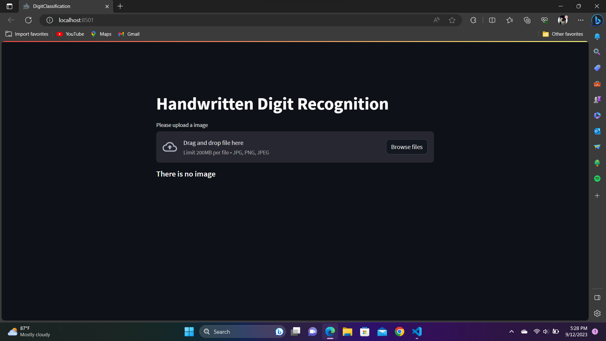
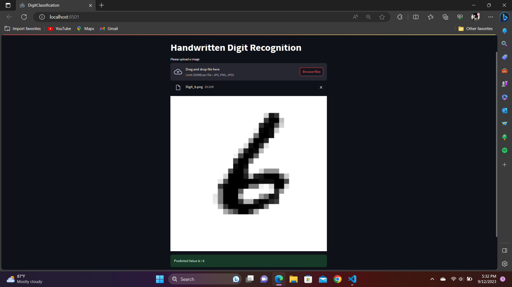
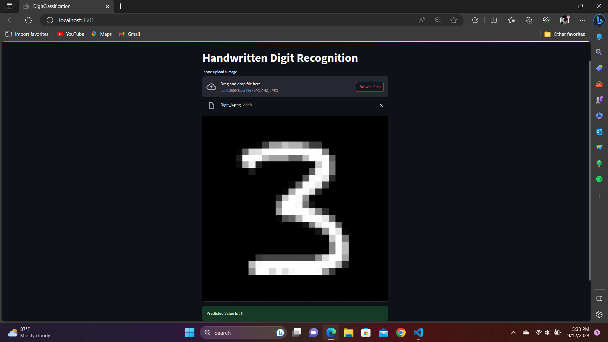

# $${\color{orange}Handwritten \space \color{orange}Digit \space \color{orange}Recognition \space \color{orange}Project}$$
## $\mathbb{\color{lime}{Overview}}$

In this project, I have developed a deep learning model based on convolutional neural networks (CNN) to excel at predicting numeric values within the range of 0 to 9 from handwritten digit images. We have also crafted a user-friendly web application using Streamlit, enabling users to upload images in JPG or PNG formats and receive accurate predictions from our model. To ensure easy access for users, we have deployed the web app on Streamlit Cloud.

## $\mathbb{\color{lime}{Objective}}$

The primary objective of this project is to create a robust and user-friendly solution for handwritten digit recognition. Handwritten digit recognition has numerous real-world applications, including digitizing handwritten documents and improving accessibility for visually impaired individuals.

## $\mathbb{\color{lime}{Key \ Components}}$

### $\mathscr{\color{lightblue}{Convolutional \ Neural \ Network \ Model}}$

- I trained a CNN model using a dataset of handwritten digits.
- The model consists of multiple convolutional layers, followed by max-pooling and fully connected layers.

### Streamlit Web Application

- I designed a web application using Streamlit, a Python library for creating interactive web interfaces.
- The app allows users to upload images containing handwritten digits in JPG or PNG formats.
- Users can submit their images to the model for predictions.

### Deployment on Streamlit Cloud

- To ensure convenient access for users, we deployed the web app on Streamlit Cloud, a platform that simplifies the deployment of Streamlit apps.
- This cloud deployment allows users to access the application from any web browser without the need for local setup.

## $\mathbb{\color{lime}{How \ it \ Works}}$

1. Users access the web app hosted on Streamlit Cloud.
2. They are presented with an intuitive interface that includes the option to upload an image containing a handwritten digit.
3. Users select an image and upload it to the app.
4. The app pre-processes the image, feeding it into the trained CNN model for prediction.
5. The model predicts the handwritten digit, and the result is displayed to the user along with a confidence score.
6. Users can easily reset the app for additional predictions or try different images.

## $\mathbb{\color{lime}{Benefits}}$

### User-Friendly Interface

- The Streamlit-based web app offers an easy-to-use interface for users of all backgrounds.

### Accessibility

- This application can assist visually impaired individuals in reading handwritten digits.

### Convenient Cloud Deployment

- Hosting the app on Streamlit Cloud ensures that users can access it from anywhere with an internet connection.

## $\mathbb{\color{lime}{Conclusion}}$

My Handwritten Digit Recognition Web App is a valuable tool for various applications that require automated digit recognition. It combines the power of deep learning with the convenience of a user-friendly web interface, making it accessible to a wide range of users. Deployed on the Streamlit Cloud, it offers seamless access and demonstrates the potential of AI and machine learning in solving real-world problems.

